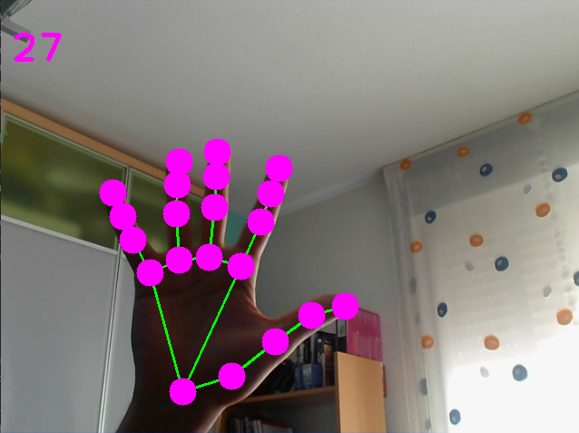

# Hand Tracker

This is a project made in python to test the following libraries: 

* MediaPipe: cross-platform framework for building multimodal applied machine learning pipelines. (https://github.com/google/mediapipe)
* OpenCV-Python: library of Python bindings designed to solve computer vision problems. (https://pypi.org/project/opencv-python/)

Here we can see a finger counter:

Here we can see a finger marker:

